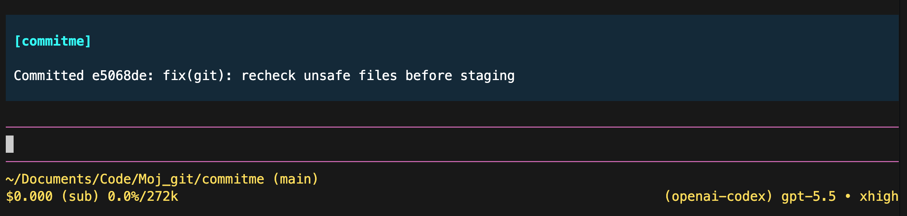

<p align="center">
  
</p>

<p align="center">
  <a href="https://pi.dev"></a>
  <a href="https://www.npmjs.com/package/@senad-d/commitme"></a>
  <a href="LICENSE"></a>
</p>

<p align="center">
  Local Lightweight Conventional Commits for <a href="https://pi.dev">pi</a>.
  <br />Gather git context, ask your active model, and create a local commit.
</p>

---

CommitMe is a pi extension for turning local git changes into clear one-line Lightweight Conventional Commit subjects. It gathers staged and unstaged git context, trims noisy diffs, redacts sensitive content, asks the active pi model for one subject line, then creates a local git commit.

<table align="center">
  <tr>
    <th>CommitMe</th>
  </tr>
  <tr>
    <td align="center">
      
    </td>
  </tr>
</table>

- **Local-git native:** reads your current repository, stages the gathered changed paths, and commits with `git commit`.
- **Local-model friendly:** builds a compact, priority-ordered prompt, reserves output budget, normalizes drafts to one subject line, and retries/repairs weak-model drafts when safe.
- **Safety-aware:** omits secret-like content from model context and refuses known secret files or high-confidence tokens.
- **No push, no telemetry:** CommitMe never runs `git push` and does not send usage telemetry.
- **Pi-native:** use it as a slash command, agent tool, global package, project-local package, git install, or source checkout.

> **Security:** pi packages run with your full system permissions. CommitMe reads git/project files, runs local `git` commands, stages gathered changed paths, creates local commits, and sends bounded context to your active pi LLM provider. Read [`SECURITY.md`](SECURITY.md).

## Table of Contents

- [Quick Start](#quick-start)
- [Installation](#installation)
- [Daily Usage](#daily-usage)
- [Shell Command and Local Models](#shell-command-and-local-models)
- [Commands](#commands)
- [Agent Tool](#agent-tool)
- [Context and Commit Standard](#context-and-commit-standard)
- [Safety Model](#safety-model)
- [Troubleshooting](#troubleshooting)
- [Update and Uninstall](#update-and-uninstall)
- [Development](#development)
- [Publishing](#publishing)
- [License](#license)

---

## Quick Start

```bash
pi install npm:@senad-d/commitme
cd /path/to/your/git/repo
pi
```

Start with confirmation enabled:

```text
/commitme --confirm focus the message on the command steering support
```

When you are comfortable with the workflow, run the fast path:

```text
/commitme focus the message on the command steering support
```

CommitMe will gather the current repository changes, ask your active pi model for a one-line Lightweight Conventional Commit subject, stage the gathered changed paths, and create a local commit. Optional steering text after the command guides the model when it matches the actual git changes. CommitMe never pushes.

---

## Installation

| Scope | Command | Notes |
| --- | --- | --- |
| Global | `pi install npm:@senad-d/commitme` | Loads in every trusted pi project. |
| Project-local | `pi install npm:@senad-d/commitme -l` | Writes to `.pi/settings.json` in the current project. |
| One run | `pi -e npm:@senad-d/commitme` | Try without changing settings. |
| Git | `pi install git:github.com/senad-d/commitme@<tag>` | Pin a tag or commit. |
| Local checkout | `pi --no-extensions -e .` | Develop or test this repository. |

Source checkout:

```bash
git clone https://github.com/senad-d/commitme.git
cd commitme
npm ci
npm run validate
pi --no-extensions -e .
```

Use a checkout globally while developing:

```bash
pi install /absolute/path/to/commitme
```

---

## Daily Usage

Inside a git repository, run one of these in pi:

```text
/commitme --confirm focus on the bug fix
/commitme add steering support for commit generation
/commitme -- --prefer feat if accurate
/commitme help
```

Recommended first run:

1. Review your working tree with `git status`.
2. Start pi in the repository.
3. Run `/commitme --confirm`, optionally followed by steering text.
4. Review the generated message in the confirmation dialog.
5. Confirm to stage the gathered changed paths and create the commit.

Use `/commitme` only when you are comfortable with CommitMe creating the commit immediately after drafting the message. Add steering text when you know the intent and want the model to prefer your wording while still checking the git context.

---

## Shell Command and Local Models

CommitMe works well as a shell command when paired with a local model. The example below uses the LM Studio `lms` CLI, loads `essentialai/rnj-1`, runs pi without a saved session, and triggers `/commitme`.

Add this to `~/.zshrc`:

```bash
commit() {
  (
    trap 'lms daemon down >/dev/null 2>&1 || true' EXIT INT TERM

    lms load essentialai/rnj-1 \
      --context-length 10000 \
      --gpu max \
      --identifier essentialai/rnj-1 >/dev/null 2>&1

    pi --no-session \
      --model local-llm/essentialai/rnj-1 \
      -p "/commitme $*"
  )
}
```

Reload your shell and use it from any git repository:

```bash
source ~/.zshrc
commit
commit focus on the parser and prompt-builder changes
commit -- --prefer feat when accurate
commit help
```

Notes:

- Install CommitMe globally first with `pi install npm:@senad-d/commitme`, or add `-e /absolute/path/to/commitme` to the `pi` command while developing from source.
- This helper uses `pi --no-session -p`, so it is intended for the fast non-interactive path. Use the TUI with `/commitme --confirm` when you want an approval prompt.
- Change `essentialai/rnj-1` and `local-llm/essentialai/rnj-1` to match your local model provider and model id.
- Increasing context length alone may not fix empty local-model drafts. Some reasoning models can spend their whole output budget on thinking/reasoning and return no final text.
- If your local provider exposes a thinking/reasoning setting, lower or disable it for CommitMe if drafts are empty or stop by length.
- Remove the `trap` line if you do not want the function to shut down the LM Studio daemon after each run.
- Rename the function to `commitme()` if you do not want to shadow a `commit` alias or function.

---

## Commands

| Command | Description |
| --- | --- |
| `/commitme [steering prompt]` | Generate a message, stage the gathered changed paths, and create a local commit. Optional steering guides wording, emphasis, type, and scope when supported by the git context. |
| `/commitme --confirm [steering prompt]` | Generate a message, ask for confirmation, then commit only if you approve. |
| `/commitme -- --steering that starts with a dash` | Use `--` before steering text that begins with `-` or `--`. |
| `/commitme help` | Show in-session help. `/commitme --help` and `/commitme -h` also work. |

CommitMe waits for the current agent turn to finish before it gathers context. It aborts when there are no staged or unstaged changes.

---

## Agent Tool

CommitMe also registers a `commitme` tool for agents.

| Tool action | Behavior |
| --- | --- |
| `action: "gather"` | Read-only. Returns compact git/project context and a subject-line prompt. Accepts optional `steeringPrompt` guidance. |
| `action: "commit"` | Requires an explicit final one-line `message`; stages gathered changed paths and creates a local commit. |

Use the tool when you want pi to draft a message without immediately committing, or when another workflow needs bounded git context.

---

## Context and Commit Standard

CommitMe gathers a compact bundle from the current repository and sends it in a local-model-friendly order:

- output contract and drafting process
- current branch and porcelain status
- staged and unstaged changed paths
- staged and unstaged diff stats
- safe snippets from changed text files
- bounded, redacted diff excerpts
- omitted-context notices and warnings
- lower-priority project metadata such as `package.json`, README, changelog, and common build config files
- truncation metadata and visible truncation notices

Contents from generated, binary-looking, unreadable, overly large, symlinked, symlink-aliased, and secret-like changed files are omitted from model context. Commit actions still locally scan changed files, including generated and binary-looking paths, for high-confidence secret tokens before staging; symlinks to sensitive repository paths are treated as unsafe.

CommitMe validates and normalizes the final subject to this one-line Lightweight Conventional Commit shape:

```text
<type>(optional-scope): <summary>
```

Allowed types: `feat`, `fix`, `refactor`, `docs`, `test`, `chore`, `build`, `ci`, `perf`, `style`, and `revert`.

Summaries should be imperative, clear, specific, and must not end with a period.

For command drafting and gather-tool prompts, CommitMe uses separate system and repository-context prompts where supported by pi, sizes the prompt to the active model when available, keeps the prompt bounded even for very large context-window local models, and asks for only the final subject line. If a model returns a verbose message with a body, CommitMe automatically extracts the first valid Conventional Commit subject and commits only that line. If a model returns empty text, thinking-only content, a length-stopped response, or an invalid subject, CommitMe retries or repairs once where safe and still refuses to commit without a validated subject.

---

## Safety Model

- CommitMe never runs `git push`.
- CommitMe does not send telemetry.
- CommitMe uses only local `git` commands and the active pi LLM provider.
- `/commitme --confirm` requires a UI-capable pi mode.
- Commit actions abort before staging if known secret files or high-confidence secret tokens would be committed.
- Large, generated, binary-looking, symlinked, and symlink-aliased changed-file contents are omitted from model context, but CommitMe still scans regular changed files locally to detect high-confidence secret tokens before staging.
- Renames from sensitive paths and symlinks to sensitive repository paths stay omitted from model context and are checked or marked unsafe before staging.
- Commit actions recheck unsafe content immediately before staging.
- Commit actions stop if git status changes after context gathering.
- Commit actions validate and normalize the drafted message to one subject line before confirmation, staging, or committing.
- Diff collection disables Git external diff and textconv commands.
- Ordinary placeholder examples such as `TOKEN=not-real` may be redacted from model context but are not treated like real secrets.

See [`SECURITY.md`](SECURITY.md) for details.

---

## Troubleshooting

| Problem | Try |
| --- | --- |
| `CommitMe must be run inside a git repository` | Start pi from a repository checkout. |
| No changes found | Check `git status`; CommitMe needs staged or unstaged changes. |
| No active model or API key | Select/configure a pi model, or use the local-model shell function above. |
| `--confirm requires a UI-capable Pi mode` | Run pi with the TUI, or use `/commitme` without confirmation in non-UI mode. |
| Commit refused for secret files/tokens | Remove the file/token from the commit, or commit manually if intentional. |
| Git status changed while CommitMe was running | Rerun CommitMe so it can gather fresh context. |
| Local model is too slow | Use a smaller model or shorten the diff before running CommitMe. |
| Empty local-model draft, thinking-only response, or `stopReason=length` | CommitMe retries with a shorter final-answer prompt and larger output budget when possible. If it still fails, reduce the change size, lower/disable model thinking, try `/commitme --confirm`, or use the `commitme` gather tool and ask the agent to draft manually. |
| Verbose local-model draft with a body | CommitMe automatically extracts the first valid Conventional Commit subject and commits only that one line. |
| Invalid Conventional Commit draft | CommitMe attempts deterministic cleanup/repair but refuses to stage or commit unless the final subject validates. Add clearer steering text or gather context manually with the `commitme` tool. |

---

## Update and Uninstall

```bash
pi update --extensions
pi update npm:@senad-d/commitme
pi remove npm:@senad-d/commitme
pi remove npm:@senad-d/commitme -l
```

---

## Development

```bash
npm ci
npm run validate
```

Useful checks:

```bash
npm run typecheck
npm run lint
npm run format:check
npm run test
npm run check:pack
pi --no-extensions -e .
```

---

## Publishing

CommitMe publishes to npm as `@senad-d/commitme`. Run from a clean working tree after updating `CHANGELOG.md`.

```bash
npm login
npm whoami
npm run validate
npm version <version>
npm publish --access public
```

Push the release commit and tag after the package is published.

---

## License

MIT
